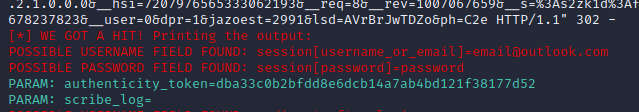

# Phishing para captura de senhas do Twitter utilizando web templates

### Ferramentas

- Kali Linux
- setoolkit

### Configurando o Phishing no Kali Linux

- Acesso root: ``` sudo su ```
- Iniciando o setoolkit: ``` setoolkit ```
- Tipo de ataque: ``` Social-Engineering Attacks ```
- Vetor de ataque: ``` Web Site Attack Vectors ```
- Método de ataque: ```Credential Harvester Attack Method ```
- Método de ataque: ``` Web Templates ```
- Obtendo o endereço da máquina: ``` ip a ```
- Pressione ENTER para confirmar o endereço IP default ou digite o endereço IP correto
- Selecione o template: ``` Twitter ```
- Digite o IP no navegador e aguarde os dados serem exibidos nos logs.

### Resutados

